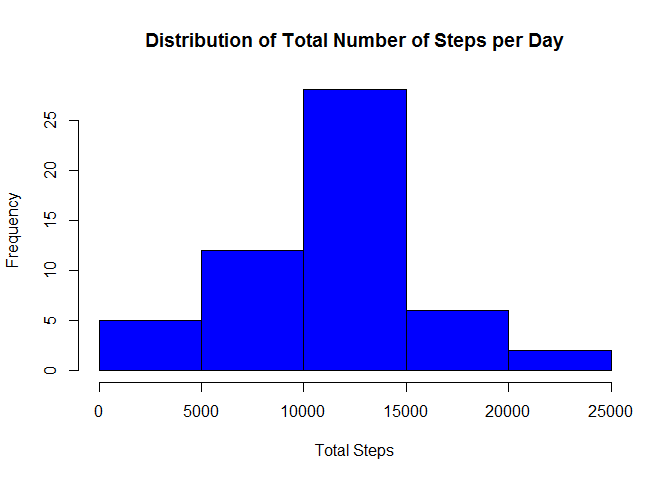
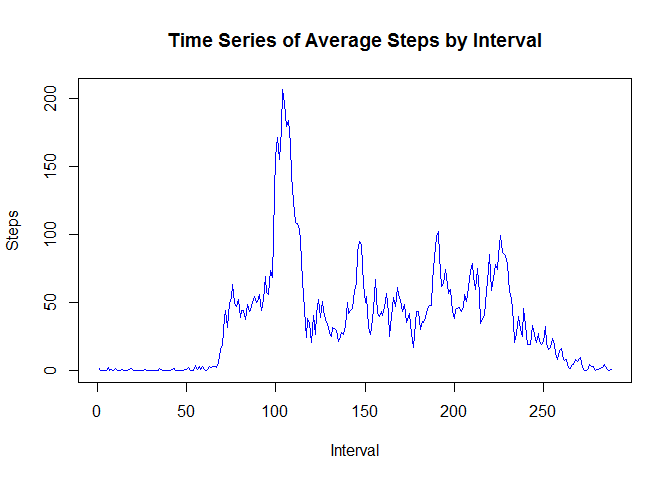
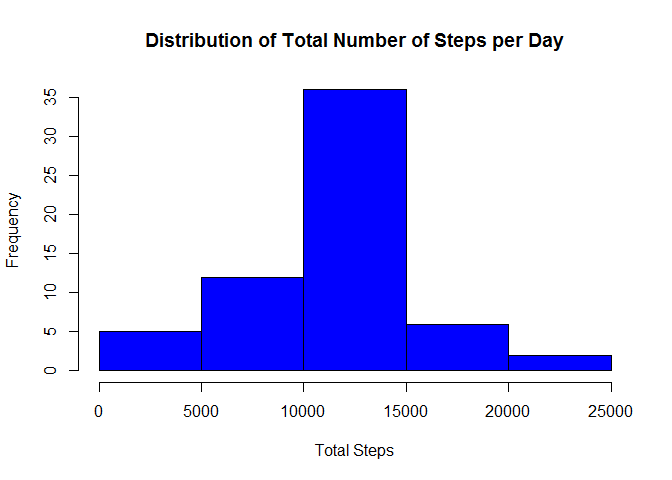
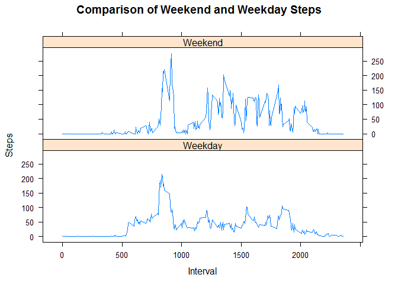

# Reproducible Research: Peer Assessment 1

## Loading and preprocessing the data

Loading and preprocessing the data

Show any code that is needed to

Load the data (i.e. read.csv())

Process/transform the data (if necessary) into a format suitable for your analysis


```r
activity <- read.csv("activity.csv")
head(activity)
```

```
##   steps       date interval
## 1    NA 2012-10-01        0
## 2    NA 2012-10-01        5
## 3    NA 2012-10-01       10
## 4    NA 2012-10-01       15
## 5    NA 2012-10-01       20
## 6    NA 2012-10-01       25
```

```r
activity$date<- as.Date(activity$date, "%Y-%m-%d")
```

## What is mean total number of steps taken per day?

What is mean total number of steps taken per day?

For this part of the assignment, you can ignore the missing values in the dataset.

Calculate the total number of steps taken per day

If you do not understand the difference between a histogram and a barplot, research the difference between them. Make a histogram of the total number of steps taken each day


Calculate and report the mean and median of the total number of steps taken per day


```r
stepbyday <- aggregate(steps ~ date, activity, sum, na.rm = TRUE)

# Total steps by date
head(stepbyday)
```

```
##         date steps
## 1 2012-10-02   126
## 2 2012-10-03 11352
## 3 2012-10-04 12116
## 4 2012-10-05 13294
## 5 2012-10-06 15420
## 6 2012-10-07 11015
```

```r
# Histogram of Steps
hist(stepbyday$steps, xlab = "Total Steps", main = "Distribution of Total Number of Steps per Day", col = "blue")
```

 

```r
# Mean Steps per day
round(mean(stepbyday$steps))
```

```
## [1] 10766
```

```r
# Median Steps per day
median(stepbyday$steps)
```

```
## [1] 10765
```

## What is the average daily activity pattern?

What is the average daily activity pattern?

Make a time series plot (i.e. type = "l") of the 5-minute interval (x-axis) and the average number of steps taken, averaged across all days (y-axis)

Which 5-minute interval, on average across all the days in the dataset, contains the maximum number of steps?


```r
# Take Mean Steps by Interval and Plot
timestep <- tapply(activity$steps, activity$interval, mean, na.rm = TRUE)
plot(timestep, type = "l", main = "Time Series of Average Steps by Interval", xlab = "Interval", ylab = "Steps", col = "Blue")
```

 

```r
# Find the Interval with Max Steps
names(which.max(timestep))
```

```
## [1] "835"
```

## Imputing missing values

Note that there are a number of days/intervals where there are missing values (coded as NA). The presence of missing days may introduce bias into some calculations or summaries of the data.

Calculate and report the total number of missing values in the dataset (i.e. the total number of rows with NAs)

Devise a strategy for filling in all of the missing values in the dataset. The strategy does not need to be sophisticated. For example, you could use the mean/median for that day, or the mean for that 5-minute interval, etc.

Create a new dataset that is equal to the original dataset but with the missing data filled in.

Make a histogram of the total number of steps taken each day and Calculate and report the mean and median total number of steps taken per day. Do these values differ from the estimates from the first part of the assignment? What is the impact of imputing missing data on the estimates of the total daily number of steps?


```r
# Find Number of NAs
nas <- sum(is.na(activity$steps))
steps <- activity$steps
averagesext <- rep(timestep, 61)

# Replace NAs with average value at the interval

for(i in 1:length(steps)) {
  if (is.na(steps[i])) {
    steps[i] <- averagesext[i]
  }
}

# Create new data set with fixed NAs

newactivity <- activity
newactivity$steps <- steps

# Plot New Total Steps by Day
stepbyday <- aggregate(steps ~ date, newactivity, sum, na.rm = TRUE)
hist(stepbyday$steps, xlab = "Total Steps", main = "Distribution of Total Number of Steps per Day", col = "blue")
```

 

```r
# Mean Steps per day
round(mean(stepbyday$steps))
```

```
## [1] 10766
```

```r
# Median Steps per day
round(median(stepbyday$steps))
```

```
## [1] 10766
```

The mean remains the same, but the median increases by one step.

## Are there differences in activity patterns between weekdays and weekends?

For this part the weekdays() function may be of some help here. Use the dataset with the filled-in missing values for this part.

Create a new factor variable in the dataset with two levels - "weekday" and "weekend" indicating whether a given date is a weekday or weekend day.

Make a panel plot containing a time series plot (i.e. type = "l") of the 5-minute interval (x-axis) and the average number of steps taken, averaged across all weekday days or weekend days (y-axis). See the README file in the GitHub repository to see an example of what this plot should look like using simulated data.


```r
dayname <- weekdays(activity$date)
activity$dayofweek <- dayname
temp <- character()
for(i in 1:length(dayname)) {
  
  if(activity$dayofweek[i] == "Saturday") {
    temp[i] <- "Weekend"
  }
  else if(activity$dayofweek[i] == "Saturday") {
    temp[i] <- "Weekend"
  }
  else {
    temp[i] <- "Weekday"
  }
}

activity$dayofweek <- temp
stepbyday <- aggregate(steps ~ interval + dayofweek, activity, mean, na.rm = TRUE)


library(lattice)

xyplot(steps ~ interval | dayofweek, stepbyday, layout = c(1,2), type = "l", main = "Comparison of Weekend and Weekday Steps", xlab = "Interval", ylab = "Steps")
```

 

There are some notable differences between weekend and weekday patterns.
